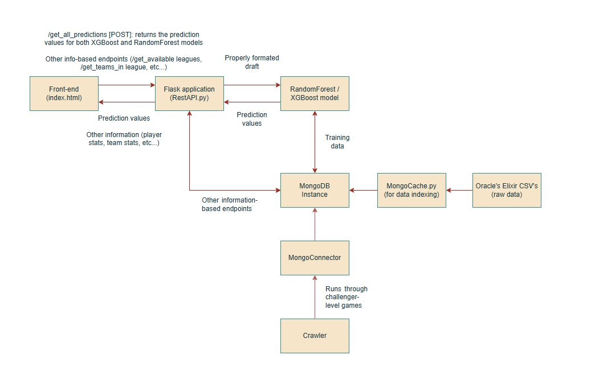

# TFG - Bachelor’s Thesis: Machine learning models to predict the outcome of professional e-sports League of Legends matches:
## Video proof of it working:
 
[In video format](media/video.mp4)

## Requirements:
- Python 3.9+  
- MongoDB  
- Oracle’s Elixir CSV datasets (downloadable & updatable via `CSVUpdater.py`)  
- Pretrained models (RandomForest, XGBoost). They can be saved after being re-trained.  

## How does it work:
### A general view:

- With `CSVUpdater.py`, Oracle's Elixir datasets are automatically downloaded or updated. This data is then processed and indexed into a local mongoDB instance.
- The two models are trained using the data collected from these datasets, using all matches from 2014 to 2025 (excluding malformed ones). 
- RestAPI.py contains a Flask application (Rest API) that has includes `POST /get_all_predictions`, which when queried with the appropiate draft data will return the winrate percentages predicted for each model (RandomForest and XGBoost).
- The frontend displays the resulting predicted values.

## Available API endpoints within RestAPI:
#### Team-related ones:
- `GET /get_team_won_lost/<team_name>`: Returns the amount of games won and lost by the given team.
- `GET /get_team_stats/<team_name>`: Returns a number of archived team statistics, such as avg. gamelength, each objective averages (dragons, barons, heralds, towers and inhibitors), avg. kills, etc... - they are all filtered by side (Blue, Red).
- `GET /get_teams_in_league/<league_name>`: Returns a list with the names of the teams that are in a given league.
#### Player-related ones:
- `GET /get_played_champions/<player_name>`: Returns a list with the names of the champions that the given pro-player has played.
- `GET /get_champion_specific_stats_by_player/<champion_name>/<player_name>`: Returns the by-champion stats that the given pro-player has.
- `GET /get_player_kda/<player_name>`: Returns the general player KDA (Kills, Deaths and Assists).
- `GET /get_player_basic_stats/<player_name>`: Returns basic stats, such as the KDA and how many won and lost games for the given player.
- `GET /get_players_in_team/<team_name>`: Returns a list with the names of the players in the given team.
#### Basic info:
- `GET /get_available_leagues`: Returns a list with the names of the archived leagues.
- `GET /get_available_champions`: Returns a list with the names of all champions.
- `GET /debug-info`: Returns important debug information about the project, such as: when where the models last trained, when did the last match saved take place, and other relevant information about the indexed data.
#### Others:
- `GET /handshake`: Simple alive ping to prevent the frontend from loading in case the Flask application is not running.
- `GET /force-update/<update_mode>`: Updates the relevant datasets and MongoCollections. The `update_modes` are the following:
  - 0: Updates all CSVs and relevant MongoCollections
  - 1: Only updates all CSVs.
  - 2: Only updates current year's CSV.
  - 3: Updates all available MongoCollections - without re-downloading the CSVs.
  - 4: Updates only the matches collection.
  - 5: Updates only the pro-player collection.
  - 6: Updates only the team collection.
  - 7: Updates only the training entries collection.
- `POST /get_all_predictions`: Returns the predicted values by the models. It recieves the names of the players and the champion selected for them and then formats the draft appropiately acording to their respective model encoder.

## Resulting MongoCollections from indexing:
#### Crawler
- `cl_players`: Contains information about Challenger-level players like their ign, leaderboard position, wins, loses, and other relevant identifying information (puuid, suuid...).
- `cl_players_matches`: Contains basic information about Challenger-level matches: participants, match_id and region.
- `cl_matches`: Same as `cl_players_matches`, but includes by-team information: bans, objectives (atakhan, baron, champion kills, dragons, horde, inhibitors, rift heralds and towers) and result.
#### Other
- `pro_cache`: Contains the professional matches in a better-structured format than in the CSV.
- `stat_cache`: Contains the necessary by-player information.
- `teamStatistics`: Contains the necessary by-team information.
- `training_entries`: Contains a cache of all training entries created to train both models, properly formatted to work with their respective encoders.
- `utils_cache`: Contains useful information: league names, teams in each league by-year...

## Project structure:
- `API`:
  - LeagueCrawler (Moved to the InProgress folder): Contains the crawler and respective endpoints for the Riot Games API - this includes account data, match data and others.
    - AccountV1.py 
    - LeagueV4.py
    - MatchV5.py
    - SummonerV4.py
    - BaseAPI.py
    - Crawler.py
  - Flask: Contains the RestAPI flask application used by the frontend to retrieve multiple types of data.
    - RestAPI.py 
  - MongoDB: Contains all the necessary files that conduct operations from and into the local mongo instance.
    - Cache: This is where the needed information is indexed.
      - Formatters: These files format the entries appropiately before inserting them into the mongo instance.
        - MatchFormatter.py
        - PlayerFormatter.py
        - TeamFormatter.py
        - TrainingEntryFormatter.py
      - MongoCache.py
    - CollectionAPIs: This conduct operations over their respective collections.
      - GeneralCollection.py
      - MatchCollection.py
      - PlayerCollection.py
      - TeamCollection.py
    - CSVUpdater.py
    - MongoConnector.py
    - MongoManager.py
    - MongoUtils.py
- `Datasets`: Contains the CSV datasets downloaded from OraclesElixir.
- `Models`:
  - RandomForest: Contains the file necessary to train and use the RandomForest model plus a cache of its encoder and pretrained model.
    -  RandomForest.py
    -  RandomForest_encoder.pkl
    -  RandomForest_model.pkl
  - XGBoost: Same as the RandomForest model, but for XGBoost.
    - XGBoost.py
    - XGBoost_encoder.pkl
    - XGBoost_features.pkl
    - XGBoost_model.pkl
  - DraftInput.py
  - ModelAPI.py
  - PredictionAPI.py
  - TrainingEntriesGenerator.py
- `InProgress`: Contains all files that are being re-formatted, added or updated.
  - PydanticUpdate: Contains the new object structure that uses pydantic and further data.
- `Utils`: Contains Utils.py (file that contains a bunch of utilitarian functions) and the old custom MongoConnector.
  - Utils.py
  - MongoConnector_OLD.py 

## Planned/ongoing improvements:
- Migration from dictionary-based processing -> Pydantic models for faster validation.
- Additional (and more detailed) data usage for the models training entries.
- General improvements to the Riot Games API Crawler.
- Clean-up of the frontend code.
